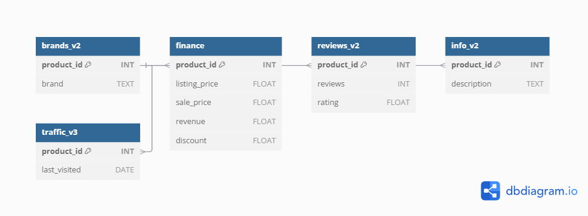

# Revenue Optimization Project
A Data Analytics Project by Kwasi Dankwa

# 📌 Overview
This project investigates pricing strategies, discount trends, product categorization, and consumer engagement metrics for Adidas and Nike—two of the world’s leading sportswear brands for an online retail store. Through SQL data analysis and interactive Tableau visualizations, this study uncovers how these brands compete across pricing tiers, consumer reviews, and revenue performance.

# 📊 Key Questions Explored
* How do the average prices of Adidas and Nike compare?

* What pricing categories (Budget, Average, Expensive, Luxury) are dominant for each brand?

* How much discount is each brand offering on average?

* Is there a correlation between reviews and revenue?

* How does product description length relate to customer rating?

* Which months or periods show review volume gaps across brands?

* How do footwear and clothing products compare in terms of median revenue?

#  🛠️ Tools Used
SQL (SQLite) – Data extraction, cleaning, CTEs, joins, aggregations, and correlation analysis

Tableau Public – Interactive dashboard creation with charts, KPIs, and filtering capabilities

# 📁 Datasets Used
[`Data Source`](https://www.kaggle.com/code/nickleejh/optimizing-online-sports-retail-revenue-using-sql/input)

brands_v2: Contains product and brand info (e.g., Adidas, Nike)

finance: Holds financial data such as listing price, sale price, revenue, and discount

reviews_v2: Contains review count and ratings

info_v2: Includes product descriptions

traffic_v3: Contains visit data for identifying consumer engagement patterns

## Data Schema

> All datasets are related through the product_id key, allowing for integrated analysis across brand, finance, reviews, and product details.

# 🧠 Key Insights

